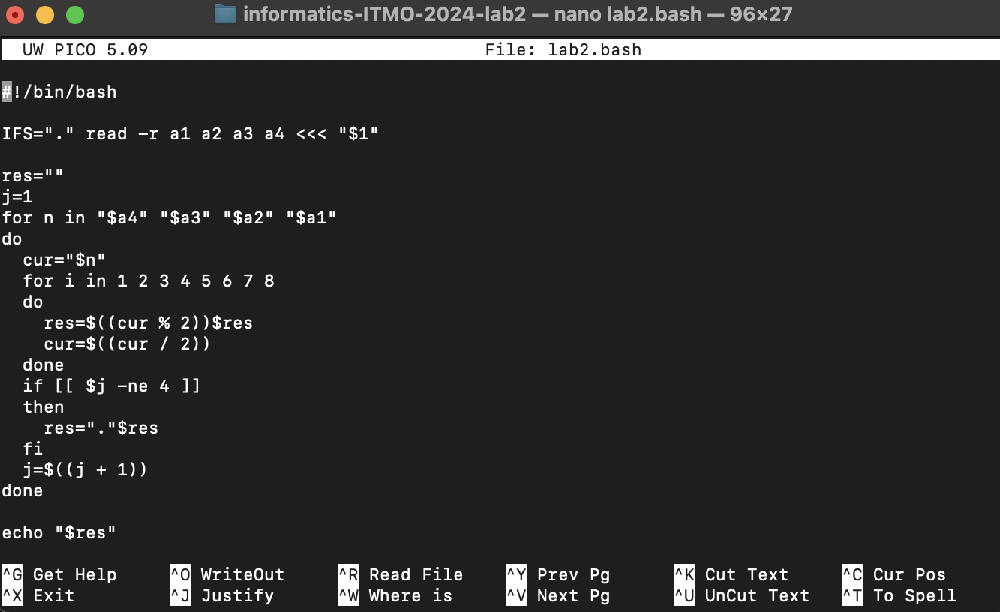
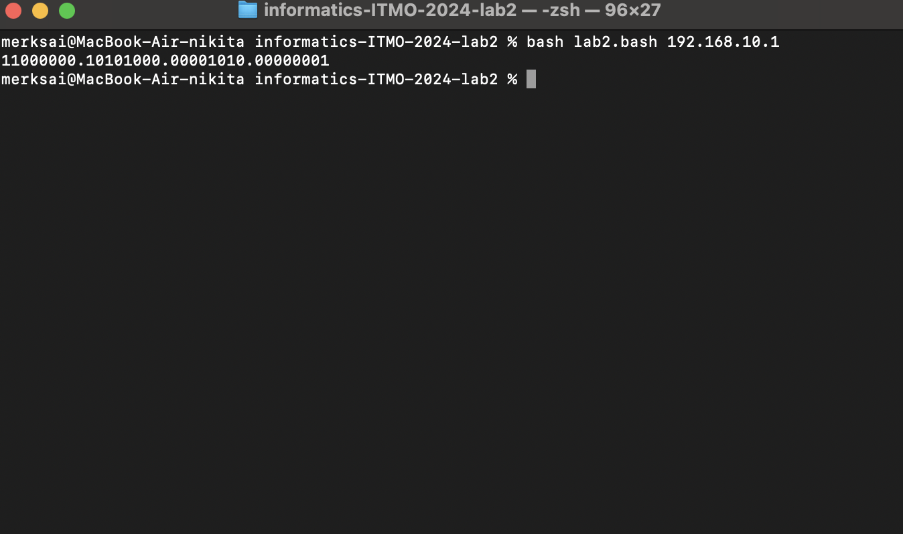

# Лабораторная работа 2

## Шаги работы:

1. Создаем файл с расширением .bash и уĸазываем путь ĸ bash-интерпретатору, используя
последовательность символов _shebang_:
```#!/bin/bash```
2. Разбираем строку по пробелам:
```IFS="." read -r a1 a2 a3 a4 <<< "$1"```
- ```IFS="."``` устанавливает разделитель,```read -r a1 a2 a3 a4``` читает строку и записывает части в переменные, ```<<< "$1"``` подаёт содержимое переменной ```$1``` (первый аргумент скрипта) в стандартный ввод для ```read```.
3. Создаем переменную для результат и счетчик, чтобы понять, когда не ставить точку в конце:
```
res=""
j=1
```
4. Перебираем байты IP адреса в обратном порядке:
```for n in "$a4" "$a3" "$a2" "$a1"```
5. Переводим ```cur``` в двоичную строку вручную:
```
for i in 1 2 3 4 5 6 7 8
do
  res=$((cur % 2))$res
  cur=$((cur / 2))
done
```
- a) на каждой итерации берем остаток от деления cur на 2 — это очередной бит, b) ```cur``` делится на 2 — идём к следующему биту, c) полученный бит добавляется в начало строки ```res```, чтобы собрать биты в правильном порядке.
6. Если ещё не последний байт, то добавляется точка перед следующим байтом, счетчик увеличивается:
```
if [[ $j -ne 4 ]]
then
  res="."$res
fi
j=$((j + 1))
```
7. Выводим результат в терминал:
```echo "$res"```

## Скрины скрипта и примеры его выполнения:


